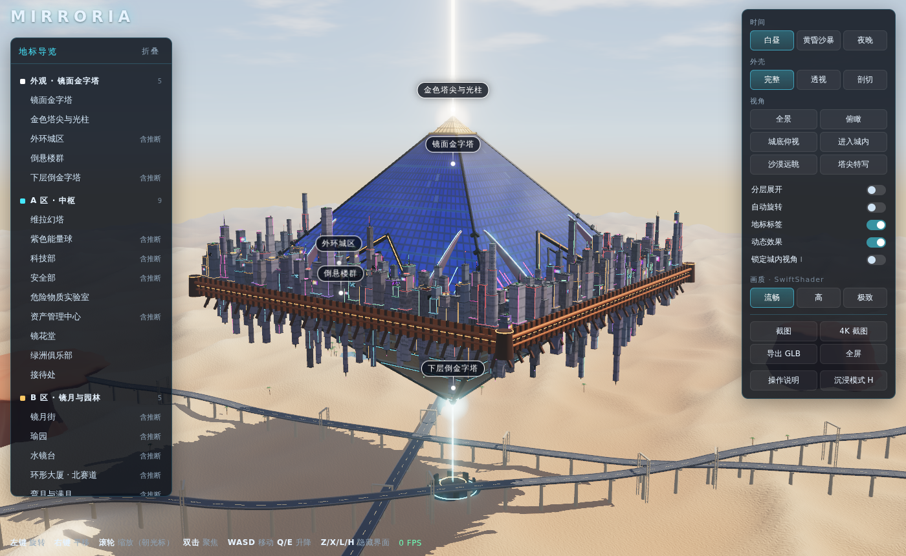

# 镜都 Mirroria 3D

基于 [three.js](https://threejs.org/)（r186）的镜都 Mirroria 交互式 3D 模型。整个项目只有一个 HTML 文件，模型全部由代码程序化生成，不依赖任何外部资源，用浏览器打开即可运行。

当前版本：**v4.1**

## 运行方式

- **本地**：下载 `index.html`，双击用浏览器（Chrome / Edge / Firefox 等）打开。
- **Logo（可选）**：把官方 logo 图片命名为 `logo.png`，放在 `index.html` 同一文件夹，左上角会自动显示。仓库中不包含该图片。

需要浏览器支持 WebGL。画质选「高」或「极致」时会开启更多后期效果，对显卡要求更高。

## 功能

- **地标导览**：25 个地标，分为五组：外观 · 镜面金字塔、A 区 · 中枢、B 区 · 镜月与园林、C 区 · 娱乐与居住、维拉沙漠。点击后飞到对应地标并显示介绍卡。
- **时间**：白昼 / 黄昏沙暴 / 夜晚
- **外壳**：完整 / 透视 / 剖切
- **视角预设**：全景、俯瞰、城底仰视、进入城内、沙漠远眺、塔尖特写
- **分层展开**、**自动旋转**、**锁定城内视角**
- **画质三档**：流畅（2K 阴影）/ 高（4K 阴影、环境光遮蔽、太阳光束）/ 极致（8K 柔和阴影、超采样）
- **导出**：截图、4K 截图、导出 GLB 模型

## 操作说明

| 操作 | 作用 |
| --- | --- |
| 左键拖动 / 单指 | 360° 旋转 |
| 右键拖动 / 双指 | 平移 |
| 滚轮 / 双指捏合 | 缩放（朝光标方向，可一路放大到街道细节） |
| 双击模型 | 把旋转中心移到该点 |
| 点击标签或左侧列表 | 飞到地标并显示介绍 |
| W A S D / 方向键 | 沿视线前进后退、左右平移 |
| Q / E · 按住 Shift | 下降 / 上升 · 加速移动 |
| R / 空格 | 回到全景 / 自动旋转 |
| 1 2 3 | 白昼 / 黄昏沙暴 / 夜晚 |
| I | 锁定 / 解除城内视角 |
| C / F | 剖切外壳 / 分层展开 |
| Z / X | 隐藏或显示左侧导览 / 右侧面板 |
| L | 隐藏或显示地标标签 |
| H | 沉浸模式：一键隐藏全部界面，再按恢复 |

## 说明

- 模型依据官方发布的截图、游戏内地图与版本公告还原外形与布局；未公开细节的部分为风格化推断，介绍卡中会标明「含推断」。
- `index.html` 是打包后的产物：three.js 与项目代码已合并压缩在同一个 `<script>` 中。
