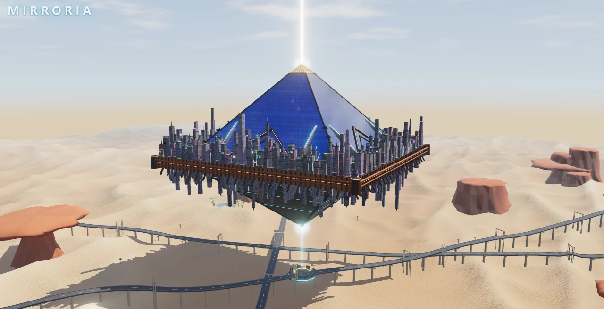

# Mirroria 3D

An interactive 3D model of Mirroria, built with [three.js](https://threejs.org/) (r186). The whole project is a single self-contained HTML file: every model is generated procedurally in code, and nothing is loaded from external sources.

Current version: **v4.1**

## Getting started

- Download `index.html` and open it in a modern browser (Chrome, Edge, Firefox, etc.). No server or build step is needed.
- The browser must support WebGL. The High and Ultra quality presets enable extra post-processing and need a stronger GPU.
- The interface is in Simplified Chinese.
- **Logo (optional):** save the official logo as `logo.png` in the same folder as `index.html` and it will appear in the top-left corner. The logo is not included in this repository.

## Features

- **Landmark guide:** 25 landmarks in five groups: Exterior · Mirror Pyramid, District A · Core, District B · Mirramoon & Gardens, District C · Entertainment & Residential, and Vera Desert. Selecting a landmark flies the camera to it and opens its info card.
- **Time of day:** day, dusk sandstorm, night
- **Shell:** full, see-through, cutaway
- **Camera presets:** overview, top-down, from below, inside the city, desert vista, apex close-up
- **Exploded layers**, **auto-rotate**, and **interior view lock**
- **Quality presets:** Smooth (2K shadows), High (4K shadows, ambient occlusion, sun rays, glass lattice shadows), Ultra (8K soft shadows, high-sample ambient occlusion, supersampling)
- **Export:** screenshot, 4K screenshot, GLB model

## Controls

| Input | Action |
| --- | --- |
| Left-drag / one finger | Orbit 360° |
| Right-drag / two fingers | Pan |
| Scroll wheel / pinch | Zoom toward the cursor, down to street-level detail |
| Double-click the model | Move the orbit center to that point |
| Click a label or list entry | Fly to the landmark and show its info card |
| W A S D / arrow keys | Move forward and back along the view direction, strafe left and right |
| Q / E · hold Shift | Descend / ascend · move faster |
| R / Space | Return to overview / toggle auto-rotate |
| 1 2 3 | Day / dusk sandstorm / night |
| I | Lock or unlock the interior view; while locked, zooming, moving and double-clicking never leave the mirror shell |
| C / F | Cutaway shell / exploded layers |
| Z / X | Show or hide the landmark guide (left) / control panel (right) |
| L | Show or hide landmark labels |
| H | Immersive mode: hide all UI, press again to restore |

## Notes

- The exterior and layout are reconstructed from officially released screenshots, the in-game map and version announcements. Details that have not been published are stylized guesses, and their info cards mark them as inferred.
- `index.html` is a build output: three.js and the project code are bundled and minified into a single inline `<script>`.
